# LAB DIO - AZURE IA

## Introdução

Para darmos incio ao laboratório é necessário criar uma conta microsoft, que pode ser utilisada na plataforma azure, azure language e azure speech. Para ativar sua assinatura, escolha a opção "*Experimente Gratuitamente*", será necessário um número de cartão de crédito.

## Azure Language Studio

O Azure Language Studio é um serviço de gerenciamento de "*Processamento de Linguagem Natural (PNL)*" que permite aos desenvolvedores entender e analizar texto.

Principais recursos do Azure Speech:

* Análise de sentimento e mineração de opiniões
* Detecção de idioma
* Extração de frases-chave
* Análise de texto para integridade
* Respostas às perguntas

## Iniciando Lab - Azure Language Studio

Acesse a plataforma https://portal.azure.com

* Na lupa pesquise por "language" e selecione.

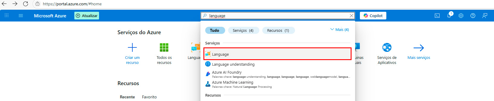

* Clique em "*Criar*"

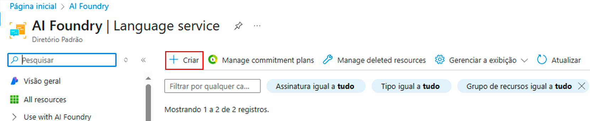

* No final da página clique em "*Continue to create your resource*"

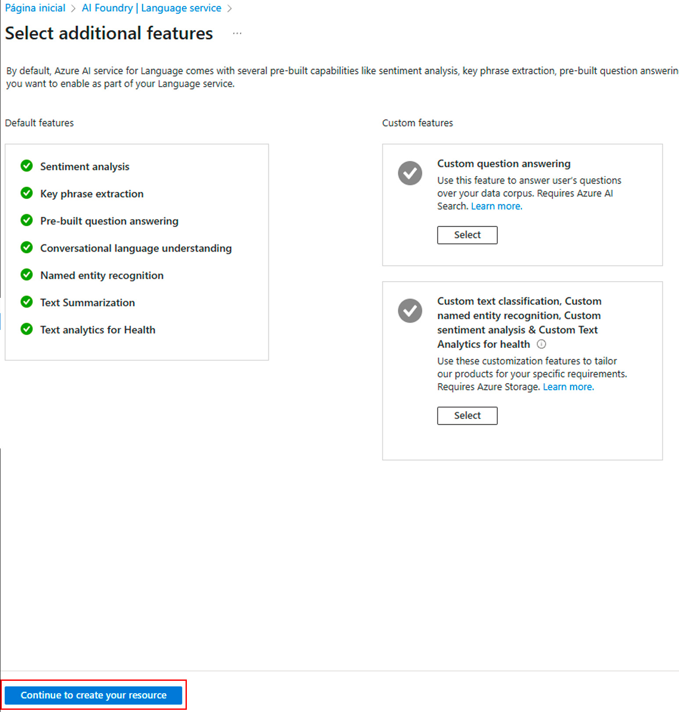

* Agora o passo a passo:
  
  1. Clique em criar e nomeie seu "*Grupo de recursos*"
  2. Escolha a região (neste caso mantivemos a região default)
  3. Nomeie sua instância.
  4. Escolha o tipo de precificação.
  5. Marque o check box sobre uso consciente de IA.
  6. Clique em "*Examinar + criar*"

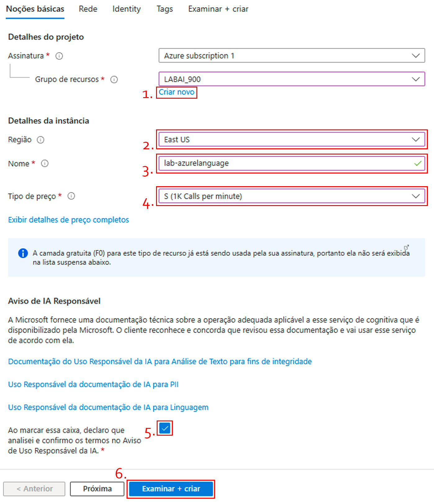

* Aguarde o processamento das informações.

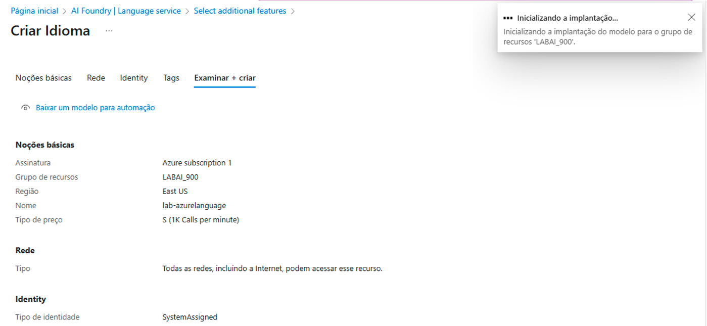

* Após a coonclusão do processamento, clique em "*Ir para o recurso*"

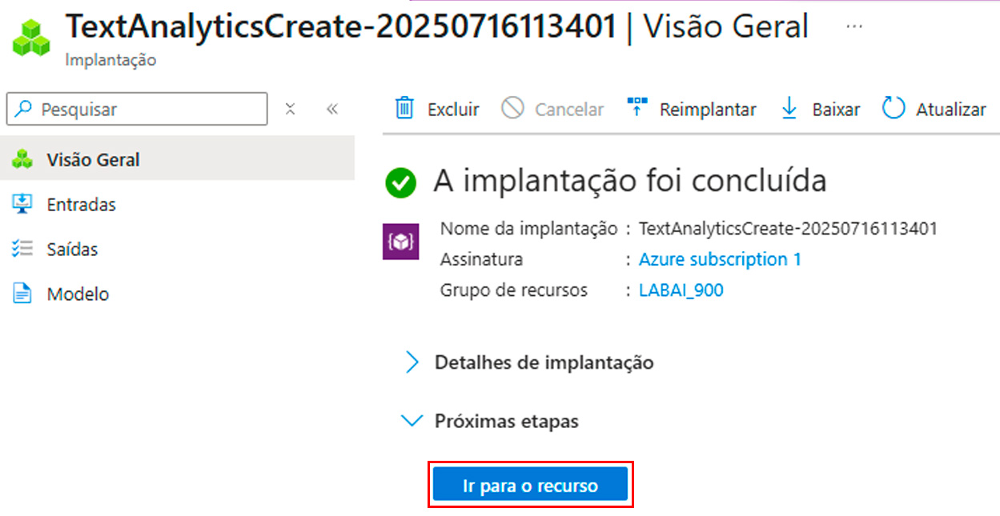

* Clique no recurso criado.

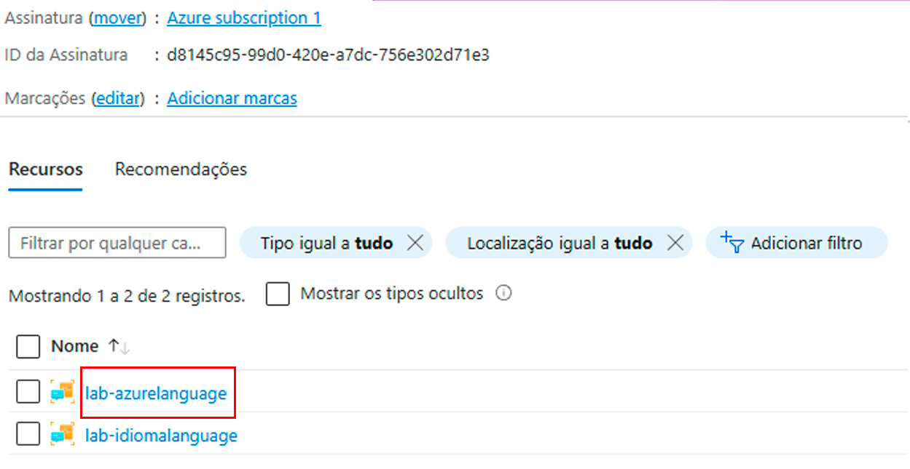

* Clique em "*Get started with Language Studio*"

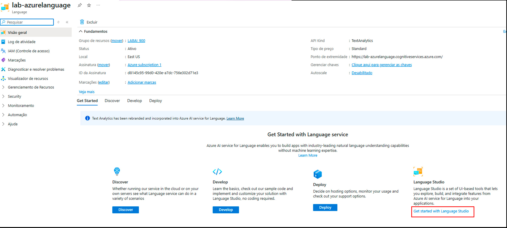

* Escolha ação que deseja, neste caso escolhemos "*Classify text*" e então vamos clicar em "*Try out*" em Analyze sentiment and mine opinions, ou seja, queremos analizar o sentimento e minerar opiniões.

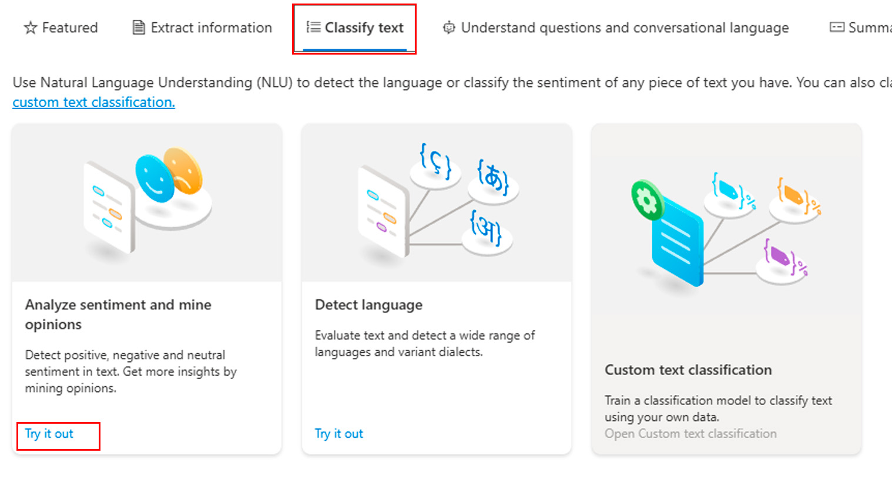

* Escolha a linguagem do texto, copie e cole o texto que deseja analizar, selecione a check box e então clique em "*Run*" para começar a analize do texto.

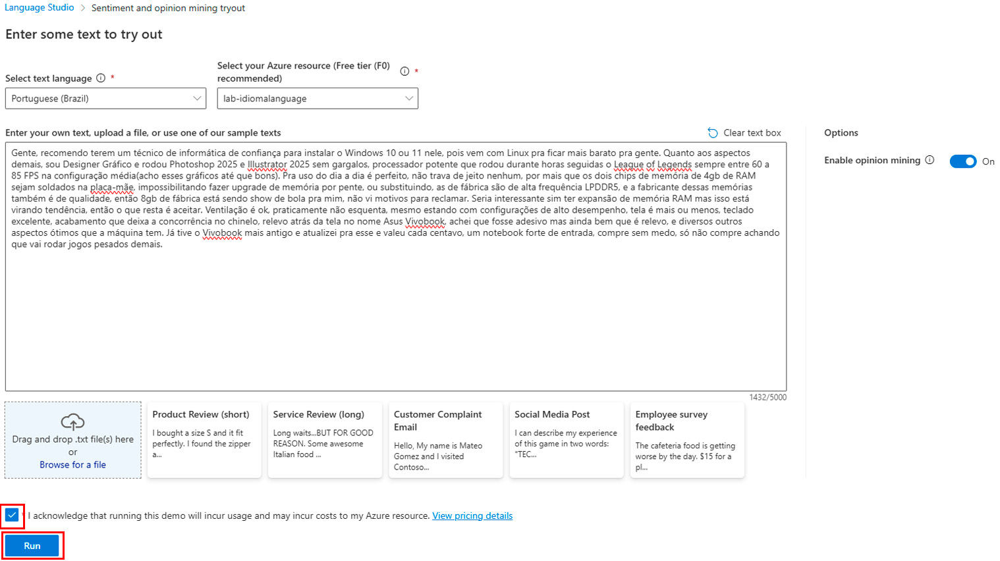

* No caso do texto analizado, a IA nos devolve o resultado de 97% de sentenças positivas, 1% neutras e 2% negativas. Podemos conferir a análise realizada em cada sentença pela IA, neste caso a Sentença 1, obteve um retorno 100% positivo.

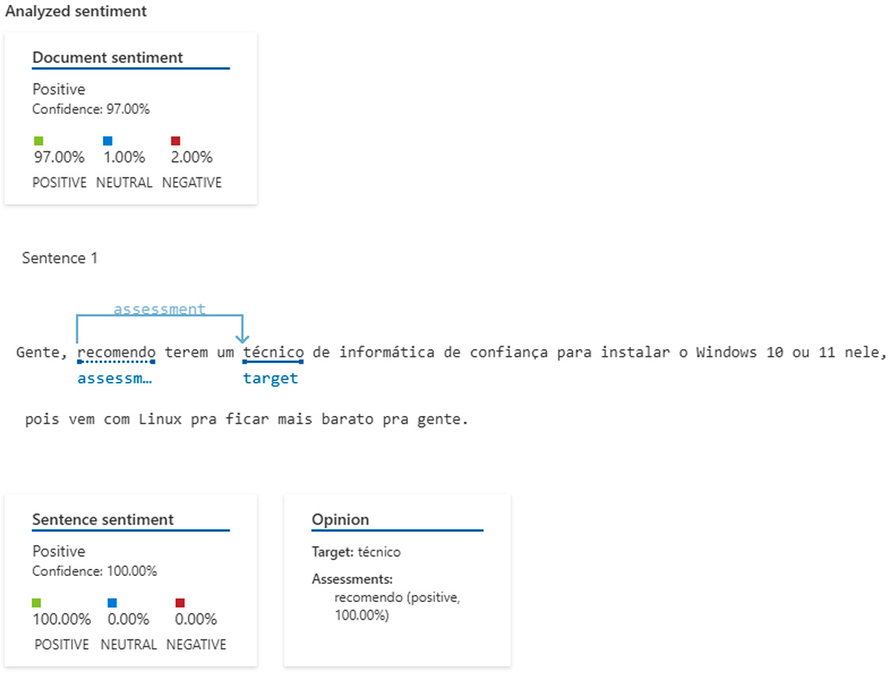

* Como podemos observar, a sentença 2, obteve um retorno 97% positivo e 3% negativo.

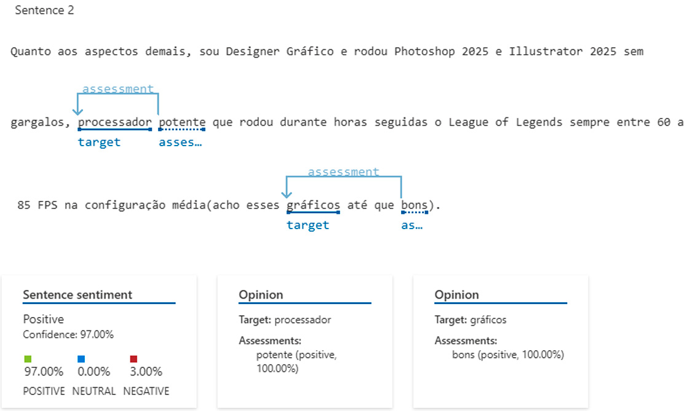

Você pode acessar a documentação oficial no https://learn.microsoft.com/pt-br/azure/ai-services/language-service/overview