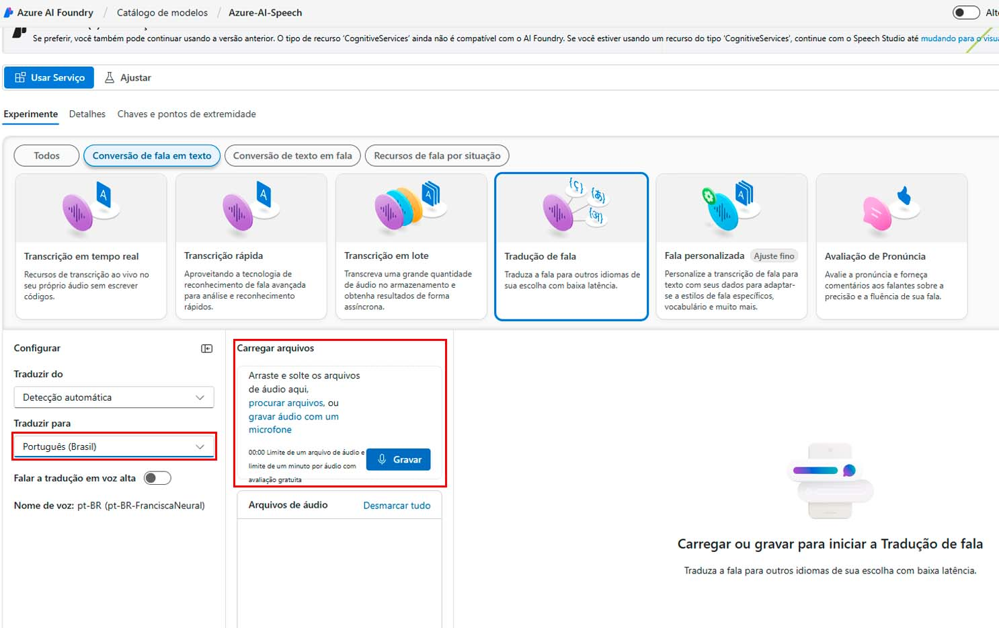

# LAB DIO - AZURE IA

## Introdução

Para darmos início ao laboratório é necessário criar uma conta microsoft, que pode ser utilisada na plataforma azure, azure language e azure speech.

É necessário ativar sua assinatura, ela pode ser ativada gratuitamente.

## Azure Speech

O Azure Speech é um serviço de fala disponível na nuvem Microsoft e faz parte do Azure IA Services. Oferece recursos de conversão, tradução e permite que desenvolvedores integrem funcionalidades de voz em suas aplicações.

Principais recursos do Azure Speech:

* Conversão de fala em texto
* Conversão de texto em fala
* Tradução de fala
* Reconhecimento do falante
* Personalização

## Iniciando Lab - Azure Speech

Acesse https://speech.microsoft.com/portal e faça seu login.

Para iniciar o teste de fala para texto:

Busque um audio que deseje transcrever e salve em um diretório do seu computador. Há samples para teste no site https://www.kaggle.com.

Na página do Azure Speech selecione a conversão desejada, no caso abaixo, selecionaremos "*Conversão de fala em texto*" em seguida "*Tradução de fala*".

Selecione o idioma para qual a tradução deve ser realizada, neste caso traduziremos para o português, deixaremos que a IA detecte o idioma original. Carregue o arquivo desejado.

Neste caso arrastaremos o arquivo fonte para dentro do Azure Speech.

Após carregar o arquivo aguarde para que a IA faça a detecção do áudio e a transcrição. Abaixo o resultado para o caso utilizado neste laboratório:

Você pode acessar a documentação oficial no https://learn.microsoft.com/pt-br/azure/ai-services/speech-service/speech-studio-overview